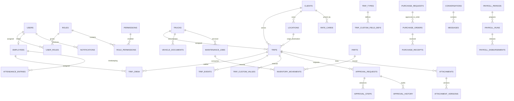

# Phase 0: Repository Audit and Gap Analysis

Audit date: 2026-09-30  
Scope: Phase 0 of `mulawin-fleetops-update-prompt-v2.md`. This was the initial audit baseline, not a current inventory of all completed work. For the latest implementation and deferred-scope status, see [REQUIREMENTS_TRACEABILITY.md](./REQUIREMENTS_TRACEABILITY.md).

## 1. Executive summary

The repository is a small, framework-free PHP 8/MySQL application with working role-gated pages and AJAX handlers for dispatch, fleet, trip monitoring, maintenance, parts, documents, billing, and user administration. Its current operating model is a single dispatcher request, reviewed by Head Management, which creates one trip. It is not yet the configurable multi-department ERP, approval framework, or trip workflow described in the prompt.

The safest approach remains additive and staged. Preserve legacy tables/routes as a compatibility layer and migrate features incrementally. The initial gap inventory below is historical; current feature evidence and validation are maintained in the traceability matrix and changelog.

The referenced interview notes, client letter, 14-page requirements document, and monitoring workbooks are not in this repository. The prompt contains summarized field requirements, so spreadsheet comparison below is against those descriptions only—not against the original workbook layouts or actual records.

## 2. Existing architecture

| Concern | Current implementation |
|---|---|
| Runtime/UI | PHP pages render Bootstrap/vanilla-JS interfaces. `pages/` contains page controllers/views; `ajax/` contains JSON handlers; `assets/` contains CSS, JavaScript, and vendored Bootstrap/Chart.js. No application framework or dependency manifest is present. |
| Configuration | `config/app.php` loads `.env` and defines four fixed role IDs, labels, dashboards, session settings, and base path. `config/enums.php` defines fixed status/document/expense values. |
| Database | PDO connection helper in `config/database.php`; base MySQL schema is `db/Mulawin_DB-Phase 1`; incremental SQL files live in `db/`. The base schema defines 21 core tables and several views. |
| Routing | Direct PHP URLs; page authorization is generally performed in-page via `requireRole`. AJAX endpoints are called directly from page JavaScript. |
| Authentication/RBAC | Session auth, login rate limiting, role-ID checks and account activation exist. The permission model is hard-coded to four roles; there are no database permission records or role-permission editor. Successful login always redirects to a role dashboard. |
| CSRF/session | CSRF helpers are in `includes/csrf.php`; session cookie flags, idle timeout, periodic session-ID rotation, and login session regeneration are in place. |
| Audit | `audit_logs` and `auditLog()` record action, user, entity/table, ID, old/new JSON, IP, and timestamp. Coverage is per-handler, not a guaranteed shared policy. |
| Recycle bin | `includes/soft_delete.php` snapshots a row into `deleted_records`, then physically deletes it from its original table; restore re-inserts it. This is recoverable archival, not soft deletion in place. It is unsuitable for financial/trip records that must be voided or retained with stable foreign-key references. |
| Uploads | `includes/document_upload.php` uses MIME allowlisting, 10 MB limit, randomized names, and stores files under `uploads/`; `ajax/document_download.php` is the protected download surface. Documents are trip-linked and have a fixed category/visibility set; this is not yet the requested polymorphic, versioned attachment/storage abstraction. |
| Tests/CI | `.github/workflows/ci.yml` runs PHP syntax checks and Node syntax checks. No application-level test suite is visible. PHP is not installed/available in this working environment, so local PHP lint cannot run; Node is available. |

### Existing database inventory

The base schema includes `roles`, `users`, `employees`, `trucks`, `routes`, `dispatch_requests`, `trips`, `trip_updates`, `incidents`, `maintenance_checklists`, `maintenance_records`, `vehicle_inspections`, `vehicle_inspection_findings`, `parts_inventory`, `parts_movements`, `documents`, `billings`, `trip_expenses`, `billing_documents`, `collections`, and `audit_logs`. Views include fleet status, active trips, low-stock parts, billing summary, and license-expiry alerts.

Migrations add clients, notification records, document expiry/visibility, user reset requests, automation settings/runs/deliveries, login attempts, trip/route additions, images and other hardening fields. There is no normalized trip crew, trip event/step history, trip custom-field model, vehicle OR/CR/insurance entity, approval engine, purchase-order/request model, fund request/cash ledger, payroll-period/timekeeping model, or messaging model in the inspected schema.

## 3. Section 4 requirement gap analysis

Status meanings: **Exists** = materially present in the current repository; **Partial** = related functionality exists but misses material requirements; **Missing** = no implementing feature/model found; **Deferred** = explicitly excluded by Section 8.

| Requirement | Status | Current evidence and gap |
|---|---|---|
| **4.1 Fleet / Truck Management** | Partial | Fleet Status supports truck type, unit number, MV file, registration/insurance and warranty expiry, images, and status history with attributed/reasoned changes. Type-specific capacity/fields and a dated downtime ledger remain. |
| **4.2 Driver and Helper Management** | Partial | `employees` holds name, position, contact, active flag, and driver license/expiry; dispatch requests have one driver and optional helper. Missing configurable “Drivers & Helpers” label, contractor/category and resignation detail, multiple crew slots/second driver, availability/overlap enforcement for all crew, shift/group dispatcher profiles, and proper trip/personnel history. |
| **4.3 Client, Destination, and Rate Master Data** | Partial | `clients` and `routes` exist; dispatch stores a client name and route ID. No billing-party/end-client relationship, client-specific location master, route/client rate cards with effective-dated history, or inactivity threshold/monitoring. |
| **4.4 Trip Management and Dispatch (core)** | Partial | Phase 3 connects requests to client, billing client, pickup/delivery, effective-rate snapshots, second drivers, booking/waybill references, unit count and ETA, and row-locked resource reservations. Phase 10 adds the ordered 13-step workflow, post-approval assignment confirmation, explicit document/allowance readiness, pre-departure checklist/inspection gates, Operations Head dispatch clearance, append-only progress events, delivery/return details (including shared waybill and co-load references), arrival inspection, and final record submission. Phase 12 adds a pre-confirmation truck/crew/schedule correction action (re-validated against the same availability and active-crew checks as new dispatches) and a printable trip pre-advice notice. Remaining: custom client fields, batch assignment. Live GPS/maps/API integration remains deferred by Section 8. |
| **4.5 Operations Head and Dispatcher Monitoring** | Partial | Phase 3 adds shift-specific dispatch plans, batches, and dispatcher encoding/review; Phase 8 adds date-filtered trip and dispatcher performance summaries. Clearance dashboard, target windows, and broader staffing comparisons remain. |
| **4.6 Vehicle Inspection and Checklists** | Partial | Fixed pre-trip `maintenance_checklists` and separate vehicle inspection/finding tables exist; inspection image/viewpoint support is migrated. No dynamic admin-configurable trip-linked departure/arrival checklist pair, first-aid exclusion enforcement, server-side minimum duration, before/after damage comparison, inspection photo attachment workflow, or VIN/unit-specific trip damage record. |
| **4.7 Maintenance Management** | Partial | Maintenance records, inspections, incidents, parts, repair work orders with availability blocking and downtime, preventive schedules, and filtered downtime/cost reports exist. Truck warranty expiry is tracked with reminders; Phase 11 adds parts warranty tracking (per-part expiry, "Warranty Expiring" tab, expiry reminders). Part-to-job usage linkage remains. |
| **4.8 Purchasing and Inventory** | Partial | Parts inventory, supplier/purchase-order workflow, approvals, receipt-driven stock-in/cost updates, and a separate office-supplies stock ledger exist. Phase 11 adds row-locked stock movements (eliminating a read-then-write race condition) and a physical-count "Adjustment" movement type for stock reconciliation (enter the counted total; the system computes and logs the signed delta). Returns/replacement workflow remains. |
| **4.9 Finance, AP, and Cash** | Partial | Trip expenses, trip costs, billing/collections and account dashboard exist; money columns use DECIMAL. No reusable fund request/approval/processing/liquidation, cash-advance ledger, AP, vouchers/cheques, chart of accounts, cash balance ledger, disbursement model, or insufficient-funds workflow. |
| **4.10 Billing, Collection, and AR** | Partial | `billings`, `collections`, `billing_documents`, billing UI, partial collection, and summary view exist. Phase 13 adds a normalized `client_id` link (alongside the free-text bill-to name), an optional client-facing invoice number/date pair, an "Unbilled Trips" dashboard tab surfacing completed trips with no billing yet, and a filtered/downloadable AR CSV export. Still missing: an effective-dated client-rate override/audit trail at billing time (rate lookup itself is already effective-dated at dispatch via `client_rates`) and billing/invoice-number format rules tailored per client. |
| **4.11 Payroll and Timekeeping** | Partial | Account-linked attendance and overtime records/reports, itemized manual payroll deductions, server-calculated net pay, and printable payslips exist. Statutory formulas, automated trip-pay calculation, biometric integration, and payroll self-service remain. |
| **4.12 Documents, Admin Records, and Messaging** | Partial | Document repository/download/expiry controls, recruitment records, and office-supplies inventory exist. Polymorphic entity links, document versions, broader Admin records, and messaging remain; real-time chat is deferred. |
| **4.13 Dashboards and Reports** | Partial | Role dashboards, analytics, trip report, billing, low-stock/fleet views, filtered Operations Performance, Maintenance downtime/cost reports, attendance, trip-operations, and now AR billing CSV exports exist. Unified cross-module export and several specialized weekly/monthly grids and comparisons remain. |

## 4. Spreadsheet-derived schema delta

The prompt describes the spreadsheet fields, but the actual workbooks are unavailable for inspecting hidden tabs, formulas, merged cells, exact weekly numbering, or data quality. Against those descriptions:

* **Trips:** add core reference/type, client and billing party, booking/nomination, origin/destination, schedule/departure/arrival/return fields, dispatcher/shift, units, waybill/DR references, delivery state, remarks, and an extensible custom-field definition/value mechanism. Current `trips` contains trip number, current status, cargo fields, expected/actual arrival and dispatch link only.
* **Crew:** replace the fixed driver/helper relation with trip crew slots and configurable role values; support second drivers, helpers, worker categories, and history. Preserve the old columns during transition.
* **Car-carrier tracking:** capture units separately from trip count, co-load/shared-waybill references, end client/company, VIN/damaged unit, pickup/delivery points, and delivery-receipt number. Do not add a globally unique waybill constraint; uniqueness scope and same-waybill cases need client confirmation.
* **Container / Wing Van:** capture container/seal/size, shipment and client/RPM waybills, location, loading/unloading timestamps, actual departure, backload/shipment number, returned pallets, client plan reference, and attachments. Use custom fields for client variation, not a single sparse giant table.
* **Fleet/status sheets:** add internal unit number, truck type, vehicle identifiers, OR/CR/MV file and receipt/registration expiry, insurance expiry, and dated status codes/reasons with downtime calculation.
* **Reference data:** normalize forwarder/company versus end client, client-specific pickup/destination lists, routes, and versioned rates with effective dates.
* **Damage sheets:** add a trip-linked damage entity with date/location, truck, crew, client/company, unit/VIN, cause, action, remarks, and evidence attachment.

## 5. Non-functional audit

This is a source-level audit, not a browser-based refresh test. No local PHP runtime/database is available here to execute the UI against populated data. The current `assets/js/layout.js` persists theme, sidebar collapse, and sidebar scroll only. No shared helper was found for active page tab, list filter/sort/page-size, open detail/modal, content scroll, or draft form recovery.

| Area | Observed state |
|---|---|
| Tabs/views reset | The pages `dispatch.php`, `maintenance.php`, `parts.php`, `billing.php`, `users.php`, and `recycle_bin.php` render a default active tab. No corresponding URL/session restoration handler was found in JS. Refresh/back/bookmark therefore does not reliably restore the selected tab. |
| Search/filter state | Some pages use GET query forms (including dispatch, trip monitoring, parts, analytics, maintenance, billing, documents, and dashboards); those submitted parameters survive refresh through the URL. Fleet Status uses in-page filter/search controls and does not expose them in the URL. No common saved-state mechanism was found. |
| Scroll/details/drafts | Only sidebar scroll restoration is present. Page/table/modal scroll, open record state, unsaved forms, multi-step drafts, and a before-leave warning were not found as shared features. |
| PRG and duplicate submit | Login uses POST handlers that redirect. Feature writes are largely AJAX/JSON endpoints, so conventional PRG does not apply to those requests; the repo does not show a common server-side idempotency token framework. Existing transaction/validation protections are endpoint-specific. An audit of each submit binding and rapid double-click behavior is still required during implementation; do not treat hidden/disabled buttons alone as sufficient. |
| Pagination and list bounds | Several pages use hard-coded caps (e.g., documents 200, billing 150, parts/trip costs 100, Requests 10); these are not a shared server-side paginator and do not establish complete pagination. Other operational lists can grow without an evident common paging helper. |
| Indexes | Useful indexes exist on many core foreign keys/status/date fields. Compound indexes for the required high-volume filters and future custom joins need query-plan review after the reports are defined. |
| Transaction/integrity | Some multi-step writes use transactions (dispatch approval, trip status/document completion, inventory operations); transactions, locks, and consistency checks are not standardized across all write handlers. Scheduling checks use calendar-day logic in at least the dispatch submission path rather than duration-based overlap locking. |
| Validation/security | CSRF, role checks, prepared statements, validation and upload checks are present in many handlers, but implementation is handler-specific. Granular permission checks, complete sensitive-document access auditing, upload storage outside the web root, and a systematic direct-URL authorization test suite remain necessary. |
| Login return path | Session timeout redirects to login and login success redirects to a role dashboard; the original page is not retained. A validated same-origin return target is needed. |
| Deployment/test limits | CI syntax-checks PHP and JavaScript only. Hostinger/Vercel runtime behavior, upload limits, cron availability, storage quota, DB version support, and browser behavior cannot be confirmed from this local source audit. |

### Known list/page refresh considerations

* **Tab state:** the six tabbed pages listed above start at their markup-default tab. Add URL state (`?tab=` or a hash) and restore on load before considering these compliant.
* **Filter/search state:** GET filters survive a refresh once submitted; client-side-only Fleet Status search/filter is lost. Page navigation and scroll are not centrally retained.
* **Pagination:** current fixed `LIMIT` values are caps rather than next/previous navigation. Reports and record lists need server-side pagination plus URL-encoded state.
* **Forms:** AJAX forms need pending/duplicate protection and server-side idempotency for consequential writes. Native forms that return redirects should retain validated fields on errors. A handler-by-handler interaction test is required before claiming PRG/idempotency complete.

## 6. Proposed additive schema and relationship outline

Exact columns, constraint names, migration order, and backfill plan belong in the relevant approved implementation phase. These are proposed logical entities; they do not represent executed migrations.

Recommended additions by dependency:

1. **Foundation/config:** `permissions`, `role_permissions` (or equivalent normalized grants), optional `user_roles` only if multiple roles are actually required, `app_settings`, `approval_types`, `approval_role_steps`, `approval_requests`, `approval_history`, notification rule/threshold configuration, attachment metadata and versions, and a shared report/state helper in PHP/JS. Preserve current role IDs and notification table during backfill.
2. **Master data:** truck type/status lookup tables; vehicle type-specific details and vehicle document/OR-CR/insurance records; employee worker category/resignation details and crew-slot roles; dispatcher shift/group; billing party/client relationship; client locations/routes; effective-dated rate cards.
3. **Operations:** trip request/batch and expanded trip data with configurable trip status/workflow steps; trip crew; append-only `trip_events`; client/trip-type custom field definitions and values; trip-linked delivery/return/damage records; approval references; overlap-safe assignment checks and indexes. Keep legacy `dispatch_requests`/`trips` data readable during conversion.
4. **Later departments:** dynamic inspection templates/submissions; maintenance jobs and part/warranty usage; purchase requests/orders/receipts and ledger-enforced inventory movement; finance requests/advances/AP/vouchers/disbursement/cash ledger; attendance/payroll runs/disbursements; document registry/admin records; optional conversations/messages.

For cross-cutting entities, use consistent audit columns and appropriate foreign keys/indexes, but avoid adding `deleted_at` blindly to append-only ledgers, approval history, or other records that must be retained. Trips and financial/inventory records should be cancelled/voided/reversed rather than removed.

## 7. Permissions proposed

Seed granular, data-driven permissions and assign only after role/department mapping is confirmed. Suggested permission keys (not yet implemented):

* `users.view`, `users.manage`, `roles.manage`, `permissions.manage`, `settings.manage`
* `fleet.view`, `fleet.create`, `fleet.update`, `fleet.status.update`, `fleet.documents.manage`, `fleet.status_log.manage`
* `employees.view`, `employees.manage`, `employees.sensitive.view`, `crew.assign`
* `clients.view`, `clients.manage`, `locations.manage`, `routes.manage`, `rates.view`, `rates.manage`
* `trips.view`, `trips.create`, `trips.update`, `trips.cancel`, `trips.assign`, `trips.approve`, `trips.clear_dispatch`, `trips.update_progress`, `trips.complete`, `trips.batch.manage`
* `inspections.view`, `inspections.submit`, `inspection_templates.manage`, `incidents.manage`
* `maintenance.view`, `maintenance.jobs.manage`, `maintenance.complete`, `parts.view`, `parts.stock_in`, `parts.stock_out`, `parts.adjust`
* `purchasing.requests.manage`, `purchasing.requests.approve`, `purchasing.orders.manage`, `purchasing.receipts.manage`, `suppliers.manage`
* `fund_requests.create`, `fund_requests.approve`, `fund_requests.process`, `fund_requests.liquidate`, `finance.ap.view`, `finance.vouchers.manage`, `finance.vouchers.verify`, `finance.vouchers.approve`, `finance.disburse`, `finance.cash.manage`
* `billing.view`, `billing.create`, `billing.update`, `billing.void`, `collections.record`, `reports.ar.view`
* `timekeeping.manage`, `payroll.prepare`, `payroll.approve`, `payroll.disburse`, `payroll.payslips.view`
* `documents.view`, `documents.upload`, `documents.download`, `documents.manage`, `reports.view`, `reports.export`, `audit.view`, `messages.view`, `messages.send`

Read-only Audit access and the payroll/timekeeping-vs-disbursement separation must be enforced server-side, not just by navigation visibility.

## 8. Phase plan adjustments

Retain the client's Operations-first order. Add two constraints to the stated plan:

* Before broad Phase 1 RBAC changes, inventory all current role checks and preserve current role IDs/routes with a compatibility adapter. Do not convert permission enforcement and feature work in one untestable migration.
* Deliver the shared attachment/approval foundations incrementally with their first consumers: define interfaces/schema in Phase 1, but ship each feature only when the corresponding approved phase needs it. This reduces risk of building an unused generic platform before its use cases are validated.

Otherwise retain Phases 0–8. In Phase 3 prioritize trip request/approval, assignment conflicts, clearance, progress/completion, and operations reporting. Do not delay that core for Finance work.

## 9. Risks and safeguards

1. **Existing-data compatibility:** roles and trip/vehicle statuses are code- and ENUM-dependent. Add lookups and new fields first; map old values with reviewed backfills; retain legacy columns until all consumers are switched.
2. **Different trip semantics:** current approval deploys the truck and creates a `Loading` trip. Phase 10 preserves that reservation and locking behavior while requiring post-approval Dispatcher confirmation, preparation, a passed checklist and departure inspection, then Operations Head clearance before `In Transit`. Legacy trips retain existing gates and are not assigned fabricated workflow history.
3. **Overlap races:** application-only availability checks can admit simultaneous conflicting assignments. Use transactions and locking plus database-supported constraints/model choices; include time-window and timezone tests.
4. **Destructive archive model:** the current recycle bin physically deletes archived source rows. Financial, inventory, approval, and trip history need void/reversal/status history rather than this helper.
5. **Migration deployment:** project setup instructions describe all migrations as safe to rerun, but some existing ALTER migrations do not use idempotent guards. New migrations need explicit versioning/preconditions and rollback notes; validate against a copy of each deployed DB before production.
6. **Security/data privacy:** permission scope expands to payroll and employee records. Keep least privilege, log sensitive reads/downloads as required, and avoid exposing payroll/personnel data in broad dashboards or browser storage.
7. **File storage:** current uploads are inside the project tree. Confirm web-server deny rules, backup/restore, maximum file size, available disk, and Hostinger path permissions before moving to configurable storage.
8. **Hosting and scheduler:** cron, PHP execution limits, database version, Vercel compatibility for PHP/MySQL, and upload quotas require deployment-side confirmation. Vercel preview should not be assumed to run this PHP application without the configured PHP runtime/backend.
9. **Unconfirmed business rules:** pay/billing calculations, roles/approval authority, co-load counts, weekly numbering, stock costing, reminders, and data retention must remain configurable or explicitly pending—not hard-coded.
10. **Validation ceiling:** CI checks syntax only. Disposable local MariaDB/browser checks cover the implemented paths, but do not replace production staging, concurrency-load, or deployment verification.

## 10. Assumptions to confirm

Carry forward the prompt's open items: driver/helper pay formulas; billing formula and tax handling; final Crew label (default “Drivers & Helpers”); trip creation/batch-release responsibility; approval chains and amount thresholds; unit-to-trip/co-load/shared-waybill counting; HR timekeeping ownership and Finance segregation rule; inventory costing method; reminder thresholds/channels; chat scope/retention; file storage location/capacity/retention; trip update interval; daily truck status codes and owner; client-specific trip fields; future truck types/statuses/checklists/roles; and additional client requirements.

Additional confirmation needed before implementation: whether original workbooks/sample data can be supplied; which production/staging database versions and data snapshots are available; whether current public routes and role IDs must remain stable; and who will run/approve migrations and backups in each hosting environment.

## 11. Phase 0 limits and verification

* Audited repository source and the summary requirements embedded in the supplied prompt.
* Did not find the original spreadsheets or other cited source documents in the repository.
* Did not connect to a database, browse the running application, alter schema, or change application code.
* CI defines PHP/JS syntax checks. Local PHP validation could not run because `php` is not on PATH; no application test suite was found.
* The exact page refresh, keyboard, role direct-URL, concurrency, and migration rollback acceptance tests remain to be exercised against a local/staging database during implementation.
